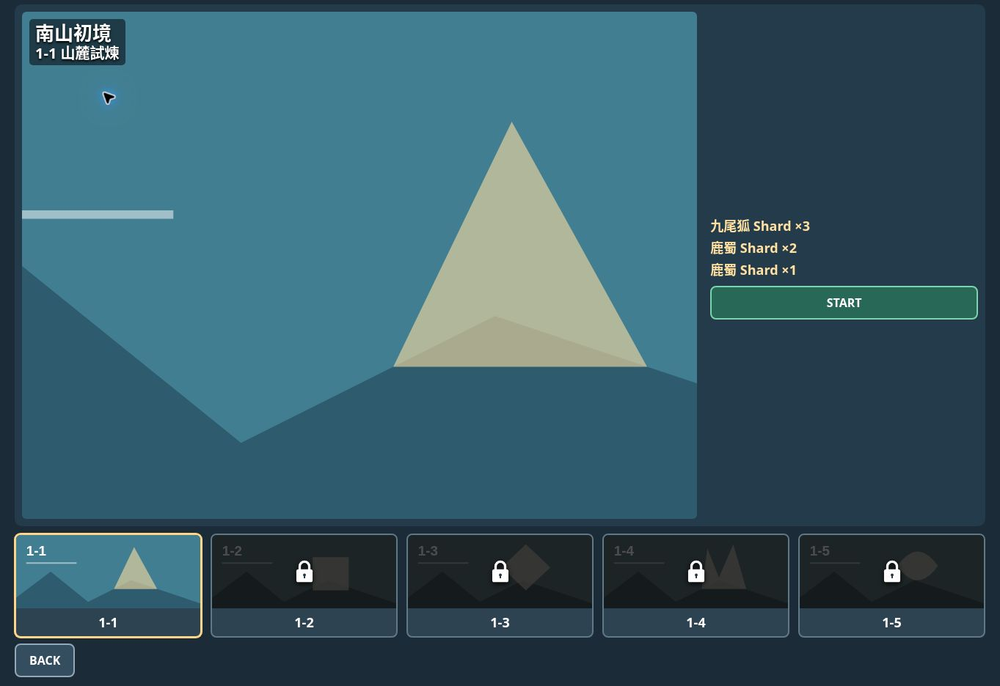
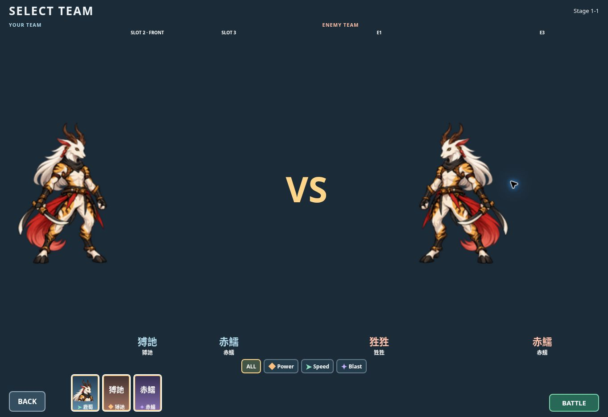

# M5C-B formal slots / Stage overlay / refresh validation

**ENGINEERING PASS / PLAYER SMOKE PENDING**

Chat checkpoint: `46cafe4b3035a2069b17a57ed597d2e11d17117f`.
Deployed source: `32b846937a7bfaff15d3d77f76baa021e0fc225a`.
Original branch `feat/m0-combat-core-20260927` /PR #1; no main merge.
Production source and art unchanged relative to Chat checkpoint; tests/docs only.

## Executable verification
Impacted71/71 PASS:

```sh
node --test tests/teamLayout.test.js tests/teamFlowView.test.js tests/teamNavigation.test.js tests/teamFilter.test.js tests/teamMatchup.test.js tests/campaignNavigation.test.js tests/formalChapter.test.js tests/lushuPresentationCorrection.test.js tests/viewportSync.test.js tests/routeOwnership.test.js tests/collectionLayout.test.js tests/collectionNavigation.test.js tests/assetMenu.test.js tests/assetIntegration.test.js tests/lushuTeamBattleCorrection.test.js
npm run build
git diff --check
```

Initial63tests59PASS/4stale failures: campaign CSS fingerprint, Stage two-line children, retired formal captions, removed deferred onload hiding. Expectations updated to approved behavior. Added shared unscaled contain fit /enemy mirror check and checked loading text hidden before load, actual failure reveals fallback. Existing required-slot/team/remove/filter/BATTLE, Tier borders/gradient, lower portrait/name/Type, Collection/Detail/resolver/viewport/lazy loading contracts PASS.

Actions #562 /37201099425 at21ddc88f7f63eacf037901432f4a9cee0b538b21 failed solely on another directly impacted test `lushuTeamBattleCorrection.test.js` still calling removed img.onload. Local reproduction6/7; test-only initial-hidden/optional-load/error-fallback update then combined71/71 PASS. No local full regression was run; existing Pages workflow retains its configured Test step.

Asset guard PASS:40files148075bytes. Build/diff PASS. Existing large battle chunk advisory remains. No runtime production defect found.

## Public executable smoke
Actual1363×936 browser:
- Formal allied/enemy full-body image boxes both262.59375×734, same contain fit and natural asset; ally transform:none, enemy matrix(-1,0,0,1,0,0). Complete full-body/horns visible with no art/UI clipping or unreadable overlap.
- Formal upper slots have no rendered slot-caption or temporary identity text. Fallback spans hidden with computed display:none; formal slot backgrounds transparent. Ally accessible SLOT metadata retained without visible scaffolding. Placeholder-only slots retain SLOT2 FRONT/SLOT3/E1/E3 and identity text.
- Lower roster portrait/name/Type retained, body not replaced with blank cards; BACK/roster/BATTLE share bottom924. No READY text.
- Stage independent h1 count0; overlay children are `南山初境` / `1-1 山麓試煉`; large visual rectx30/y16/w920.171875/h692. Overlay fully inside preview; right rewards/START unobscured, no duplicate right title.
- Stage and Team root clientHeight=scrollHeight936, clientWidth=scrollWidth1363, scrollTop0. No outer scrolling. Existing short-landscape row budgets and equal-size CSS checks PASS; physical iPhone/Safari fit remains player smoke.
- Fresh reload returns Landing; re-entering Stage/Team yields exactly one campaign page, formal images loaded, no visible fallback spans/captions or graybox backgrounds/remnants. Loading-time absence is separately checked before onload in tests; no claim of frame-by-frame slow-network capture.
- Team BACK returns selected Stage1-1, two-line overlay retained, root scrollTop0 with equal936 heights.




## Actions / public fingerprint
Actions #563 /37201222388 SUCCESS; build111433143965 Test/Build/Upload PASS; deploy111433216437 Pages PASS.
Public https://hansen0318.github.io/shanhaijing-arena/ matches local built bytes:

| File | SHA-256 |
| --- | --- |
| index.html | e0528611f35190d7f8695589a29a2f38afa9206a49517f7d2d2d1aeb7c38ba22 |
| assets/index-DM75iJjG.js | 520378bcb3c02d411944cb63631cf0c4396d97a21ef1bd53ed03b7c9dccc615e |
| assets/index-BFUQEjl4.css | 741b55a23d9dd9b863619c902dc128a4f54f14c1367124908a16475a1a91edec |
| assets/battleRuntime-BdWZaRMP.js | 8feb71329b9182d1b82da1c25743e1052afe15e9d261e314b5de2bf13bf9fdd8 |

## Stop
Focused phone smoke only: equal formal ally/enemy size and retired upper captions; placeholders still present; Stage two-line title; refresh/no remnants/no overlap/outer-scroll and BACK. No new characters, state art, VFX/audio/Chapter2; no merge main. Chat review follows player acceptance.
