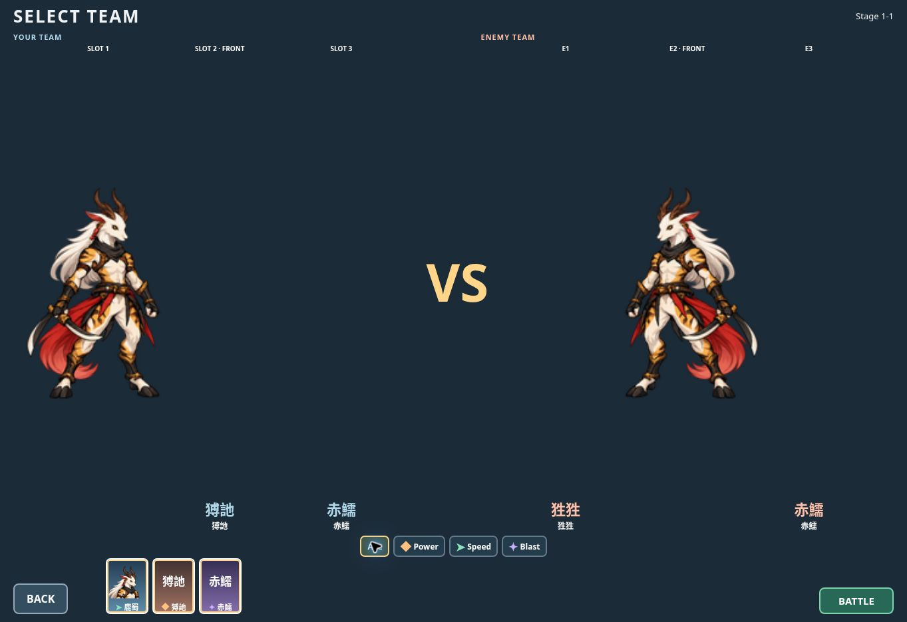

# M5C-B Stage / Team / action-facing verification

**ENGINEERING PASS / PLAYER SMOKE PENDING**

Chat checkpoint: `cee00e5e024a8a5fbc758e65a3ebd3b2468f5386`.
Deployed source: `c8fd8b4ec7b60e7bd2781a35491358b49b33c93c`.
Branch: `feat/m0-combat-core-20260927`; PR #1 remains open; no main merge.

## Executable validation
71/71 impacted tests PASS. Command:

```sh
node --test tests/teamLayout.test.js tests/teamFlowView.test.js tests/teamNavigation.test.js tests/teamFilter.test.js tests/teamMatchup.test.js tests/campaignNavigation.test.js tests/formalChapter.test.js tests/lushuPresentationCorrection.test.js tests/lushuIdle.test.js tests/viewportSync.test.js tests/routeOwnership.test.js tests/assetPresenter.test.js tests/collectionLayout.test.js tests/collectionNavigation.test.js tests/assetMenu.test.js
npm run build
git diff --check
```

Updated stale campaign CSS fingerprint, three-row and intentional overlap expectations. Landing CSS section preserved. Added Stage overlay-only id/name check and bounded attack/cast-facing priority, expiry to movement, rest retention, frozen clock, unchanged actor/origin and cleanup checks. Existing idle/facing/missing-state/KO/viewport/asset ownership contracts remain PASS. No combat/AI/movement/save/progression files changed.

Asset guard PASS:40 files /148075 bytes. Build/diff PASS. Existing large battle chunk advisory remains; no architectural changes.

## Actual runtime defect
Checkpoint `2cc78902527109702342098ce93a61d36f144fa5`, Actions #550 /37198636741 Test/Build/Pages SUCCESS, enabled public inspection. Team at1363×936 computed padding-bottom66px: roster bottom870 versus BACK/BATTLE bottom924. Shared `.campaign-page:not(.landing-page)` beat `.team-page` specificity.

Only production correction: three Team selectors become `.campaign-page.team-page`, imported after campaign CSS, retaining all Chat dimensions/media rules. Cascade regression failed before fix and passed after. Public corrected padding-bottom12px; roster/BACK/BATTLE all bottom924. Page clientHeight=scrollHeight=936, no outer scroll. Short landscape row budgets incl.320px height/21px safe inset tested; physical iPhone/Safari acceptance remains pending.

## Public inspection
At1363×936:
- Stage id/name overlay at preview top-left; no repeated title on right; rewards/START separate and unobscured; page clientHeight=scrollHeight936.
- Team allied full-body left/enemy right; VS; formal identities fully visible and larger than portrait cards. Placeholder identities remain. Lower portrait uses contain with full horns/name/Type. Roster overflow-x:auto, overflow-y:hidden; available three owned cards fit without needing scrolling at this viewport. Speed/All filters work; BATTLE right/BACK left; no READY text. Actual narrow-phone scrolling/readability still player smoke.
- Team BACK returns Stage1-1 with root scrollTop0, clientHeight=scrollHeight936. Battle Exit returns Stage; no canvas remains after return.
- Battle shows formal allied/enemy 鹿蜀 without graybox dot/ring/identity label; other actors retain placeholders. Pause/Resume accessibility states toggle correctly.
- One battle entry during deployment switching failed; reloading completed release and retrying loaded Battle successfully. No production correction warranted.
- Cloud battle clock remains at initial countdown3. Sustained motion/action-facing/idle is not claimed as browser-verified; frozen/resumed battle-time and facing behavior are automatically tested. Device smoke is required.



## Deployment fingerprints
Actions #551 /37198834715 SUCCESS; build111426148744 Test/Build/Upload PASS, deploy111426201610 Pages PASS.
Public https://hansen0318.github.io/shanhaijing-arena/ matches local built bytes:

| File | SHA-256 |
| --- | --- |
| index.html | 34bf5f578df9cb160fb33186ea70c2b7955df855bf5622850662907ff3639135 |
| assets/index-CAIw_s5b.js | 0ed425511756ef8a99f5a0acdf0b3a085cddd2c2573ad27c51829e5bd8582bd9 |
| assets/index-DapD6M69.css | 911df2911d18f8f1f0aa956dbecd035d21db46cac12a3aa6dc39fbb6393ff9df |
| assets/battleRuntime-Dxl519vC.js | e71d355854ca258ba0f8f6ded90f3fb0b25c34ddfbd4d1e43a694e270af1d686 |

Public portrait.png /identity.png /battleIdle-4f.png also resolve and match local bytes; approved art unchanged.

## Stop boundary
Player checks only Stage overlay/readability, Team enlarged preview/bottom roster/controls/BACK and attack/cast left/right then movement/rest facing. No new characters, formal state art, animation systems, VFX/audio/Chapter2. Chat post-acceptance review follows player PASS.
